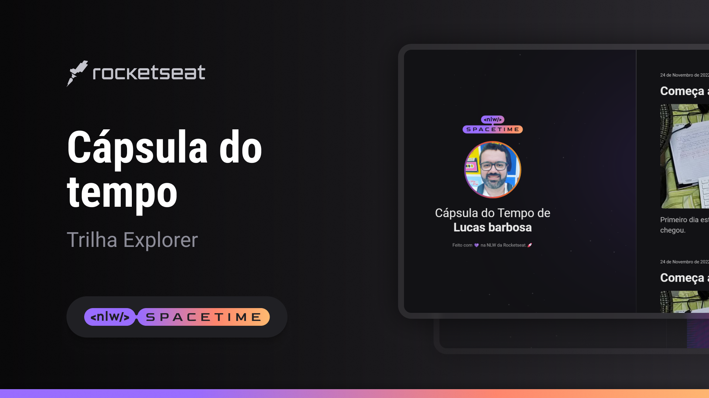

<h1 align="center">
  
</h1>
<h1 align="center"> Desafio Rocketseat: Página de Receita </h1>

  <a href="#-tecnologias">Tecnologias</a>&nbsp;&nbsp;&nbsp;|&nbsp;&nbsp;&nbsp;
  <a href="#-projeto">Projeto</a>&nbsp;&nbsp;&nbsp;|&nbsp;&nbsp;&nbsp;
  <a href="#memo-licença">Licenças</a>

  

 

## 💻 Projeto

Esse é um projeto WEB responsivo deuma cápsula do tempo, para exibir memórias em uma Timeline.

## 🚀 Tecnologias

Esse projeto foicriado durante a NLW da Rocketseat com as seguintes tecnologias:

- HTML
- CSS
- Git e GitHub

## 🏷️ Layout

Você pode vizualizar o Layout do projeto através
[desse link](https://lucasbah.github.io/NLW-SPACETIME/)
